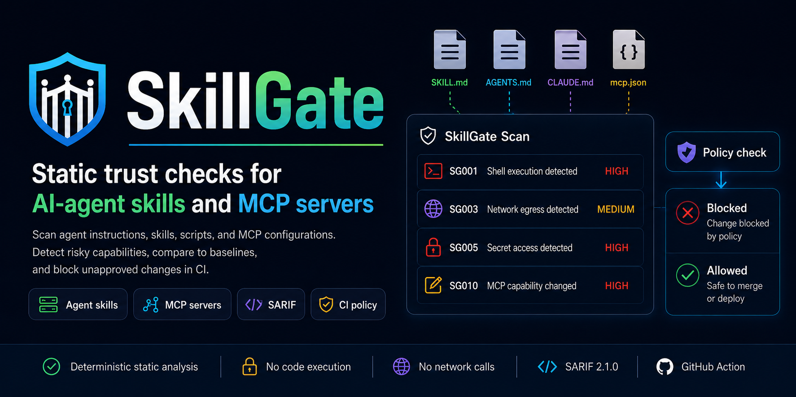

# SkillGate - Static trust checks for AI-agent skills and MCP configurations

[](https://github.com/charliechenye/SkillGate/actions/workflows/skillgate.yml)
[](https://github.com/charliechenye/SkillGate/releases/latest)
[](pyproject.toml)
[](LICENSE)
[](https://docs.oasis-open.org/sarif/sarif/v2.1.0/sarif-v2.1.0.html)




SkillGate is a local-first static trust gate for AI-agent skills, instruction files, helper scripts, and Model Context Protocol (MCP) metadata. It helps reviewers answer one practical question before install or merge:

> What new agent capability would this code or configuration introduce?

SkillGate does not execute repository code, start MCP servers, call LLMs, or install remote packages. It scans files, reports capabilities and findings, and lets teams block unapproved behavior with policy-as-code.

## Try The Local Demo

After installation, build and scan a deterministic MCPB demo without downloading
or running any third-party code:

```bash
skillgate demo mcpb --output test-outputs/reviewable-node.mcpb --scan
```

The demo prints the bundle hash, detects the startup entry point, and reports
the endpoint and secret references a reviewer should inspect:

```text
Built deterministic demo MCPB: test-outputs/reviewable-node.mcpb
SHA-256: 6948b641f88671717de7142ce075f21f9710621392b115a311eee05831fe5a1c

SkillGate MCPB scan completed
Entry point: server/index.js
Endpoint: https://api.example.invalid/v1
Secret reference: SERVICE_TOKEN
```

## Start With Three Workflows

Before installing a public skill, MCP server, or MCP bundle:

```bash
python -m pip install "git+https://github.com/charliechenye/SkillGate.git@v0"
skillgate github scan https://github.com/addyosmani/agent-skills/tree/main/skills --fail-on high
skillgate mcpb scan bundle.mcpb --fail-on high
```

Before merging an agent-tooling change:

```bash
skillgate scan .
```

When you are ready to enforce approved behavior:

```bash
skillgate policy init --profile strict --output skillgate.yaml
skillgate check . --policy skillgate.yaml
```

That is the primary workflow. Baselines, provenance, inventory reports, registry
comparison, SARIF upload, and advanced GitHub Action settings are available
after the first useful scan.

For concrete examples of how to interpret output, see the
[public scan reports](docs/public-scan-reports/README.md).

## Choose Your Use Case

| Use case | Start here | What you get |
| --- | --- | --- |
| Scan a local skill or agent repo | [`skillgate scan .`](#1-scan-a-local-repository) | Nonblocking findings and capability inventory |
| Check a public GitHub skill repo before installing | [`skillgate github scan URL`](#2-scan-a-github-repository-before-installing) | Sparse remote scan with immutable ref manifest |
| Block unapproved behavior in CI | [`skillgate check . --policy skillgate.yaml`](#3-enforce-policy-in-ci) | Policy violations, explanations, approvals, waivers |
| Detect capability drift after review | [`skillgate baseline create`](#4-track-approved-baselines-and-drift) | Stable lockfile and `SG010` drift findings |
| Inspect an MCP bundle before installing | [`skillgate mcpb scan bundle.mcpb`](#5-scan-an-mcp-bundle-before-installing) | Static startup, file, endpoint, secret-reference, binary, and nested-archive review |
| Inspect MCP registry metadata without installing | [`skillgate mcp registry scan`](#6-review-mcp-registry-metadata) | MCP tool, transport, package, and registry drift checks |
| Build a review inventory | [`skillgate inventory .`](#7-build-a-capability-inventory) | Trust-boundary summary and filterable JSON |
| Upload findings to GitHub code scanning | [`--format sarif`](#8-export-sarif-for-github-code-scanning) | Stable SARIF alerts with capability tags |

## Install

Install the latest compatible GitHub release tag today:

```bash
python -m pip install "git+https://github.com/charliechenye/SkillGate.git@v0"
skillgate --version
skillgate --help
```

`v0` is the moving compatibility tag for the latest compatible published `0.x`
release. For a concrete release tag, use the latest published version from
[GitHub Releases](https://github.com/charliechenye/SkillGate/releases/latest).

For a fully immutable install, pin a commit SHA:

```bash
python -m pip install "git+https://github.com/charliechenye/SkillGate.git@FULL_COMMIT_SHA"
```

Resolve the exact commit SHA with:

```bash
git ls-remote https://github.com/charliechenye/SkillGate.git refs/tags/v0
```

To inspect the latest release tag without installing:

```bash
git ls-remote --tags https://github.com/charliechenye/SkillGate.git "refs/tags/v*"
```

Teams that require maximum reproducibility should pin the full commit SHA in
install commands and GitHub Action references.

GitHub installs require Python 3.11 or newer and `git` on the customer machine.
After PyPI publication, the preferred low-friction install path will be:

```bash
pipx install openevalgate-skillgate
skillgate scan .
```

Also validate one-shot usage with:

```bash
uvx openevalgate-skillgate scan .
```

Experimental Node wrapper, after standalone GitHub Release assets are published:

```bash
npx --yes github:charliechenye/SkillGate#v0 -- scan .
```

This GitHub-first `npx` path does not require PyPI or npm registry publication.
Bare `npx skillgate scan .` remains future work because it requires an npm
package name and an intentional npm publication strategy. The root npm package
is marked private until then. Details: [GitHub-first Node wrapper](docs/node-wrapper.md).

For contributor or source-checkout development:

```bash
python -m pip install -e .
skillgate --version
skillgate --help
```

## 1. Scan A Local Repository

Use `scan` when you want visibility without blocking anything:

```bash
skillgate scan .
skillgate scan . --severity high
skillgate scan . --format json
skillgate scan . --format sarif --output skillgate.sarif
skillgate scan . --fail-on high
```

`skillgate scan` exits `0` even when findings exist unless you pass `--fail-on medium|high|critical`. It is a good first command for adoption, audits, and local review.

SkillGate scans agent instructions, skill files, scripts, package configs, MCP configs, MCP bundles, and MCP registry metadata. It reports rules `SG001` through `SG015`, covering shell execution, destructive actions, network egress, remote download execution, secret access, filesystem writes, prompt override language, obfuscation, MCP config discovery, MCP drift, MCP tool metadata risks, MCP transport risks, MCP registry drift, MCPB startup/reference mismatches, and MCPB embedded artifacts that require review.

Useful follow-ups:

```bash
skillgate rules list
skillgate explain SG004
```

## 2. Scan A GitHub Repository Before Installing

Use `github scan` before copying or installing public skills or agent tooling:

```bash
skillgate github scan https://github.com/phuryn/pm-skills
skillgate github scan https://github.com/addyosmani/agent-skills/tree/main/skills
skillgate github scan https://github.com/phuryn/pm-skills --ref main --fail-on high
skillgate github scan https://github.com/phuryn/pm-skills --format json
skillgate github scan https://github.com/phuryn/pm-skills --manifest-output remote-manifest.json
```

Remote scans are static and sparse. SkillGate resolves the requested branch or tag to an immutable commit SHA, fetches GitHub tree metadata at that SHA, downloads only supported agent files plus referenced local scripts, scans a temporary sparse mirror, and deletes it. It never executes remote repository content.

JSON output includes `scan_report` and `remote_manifest`. Use `--manifest-output` to save the manifest for text or SARIF scans. The manifest records the source URL, requested ref, resolved commit SHA, downloaded paths, SHA-256 hashes, byte counts, skipped files, and resource limits.

Full workflow: [GitHub pre-install scans](docs/github-preinstall-scan.md).

## 3. Enforce Policy In CI

Use `check` when findings should block a merge or release:

```bash
skillgate policy init --profile strict --output skillgate.yaml
skillgate check . --policy skillgate.yaml
skillgate check . --policy skillgate.yaml --dry-run
skillgate check . --policy skillgate.yaml --format json
skillgate policy schema --output skillgate-policy.schema.json
```

Policy files support:

- durable capability approvals, such as `policy.network.allow`, `policy.shell.commands.allow`, `policy.filesystem.write`, `policy.secrets.env.allow`, `policy.capabilities.allow`, and reviewed MCP baselines;
- deny rules for capability groups and network categories;
- high-risk thresholds with `policy.risk_threshold.block`;
- rare expiring finding waivers under `policy.waivers.entries[]`.

Use capability approvals for expected behavior such as `api.github.com`, `generated/**`, or `bash scripts/build.sh`. Use finding waivers only when one specific risky finding remains risky but has been reviewed, for example a temporary waiver for one `SG004` installer finding.

Docs and schema:

- [Policy schema reference](docs/policy-schema.md)
- [Machine-readable JSON Schema](schemas/skillgate-policy.schema.json)
- [Schema-aware editor setup](docs/editor-setup.md)
- [Example policy](skillgate.example.yaml)

## 4. Track Approved Baselines And Drift

Use baselines when you want to approve the current capability set and catch future changes:

```bash
skillgate baseline create . --output skillgate.lock
skillgate diff . --baseline skillgate.lock
skillgate diff . --baseline skillgate.lock --fail-on-drift
skillgate diff . --baseline skillgate.lock --policy skillgate.yaml
```

Baseline diffs are advisory by default and exit `0` so reviewers can inspect
drift before enforcing it. Add `--fail-on-drift` to block CI on any file,
capability, or MCP drift without a full policy file. Add `--policy` when drift
should be evaluated through policy rules such as `policy.mcp.require_review_on_change`.
Baseline diffs produce `SG010` for MCP capability drift. Review expected MCP
changes, then update the baseline. Do not disable drift review just to make CI green.

Teams that want provenance for approved policy and baseline files can create a checksum manifest:

```bash
skillgate provenance create --policy skillgate.yaml --baseline skillgate.lock --output skillgate.provenance.json
skillgate provenance verify --manifest skillgate.provenance.json
```

## 5. Scan An MCP Bundle Before Installing

Use `mcpb scan` to inspect a local MCP bundle before installing or executing its server:

```bash
skillgate mcpb scan bundle.mcpb
skillgate mcpb scan bundle.mcpb --format json
skillgate mcpb scan bundle.mcpb --format sarif --output skillgate-mcpb.sarif
skillgate mcpb scan bundle.mcpb --fail-on high
skillgate mcpb scan bundle.mcpb --manifest-output bundle-manifest.json
```

SkillGate does not execute bundle content, start MCP servers, install packages, or resolve dependencies. It safely inspects the ZIP-based bundle, parses the root `manifest.json` narrowly for startup-relevant fields, inventories members, selects first-party source for the existing rule engine, and reports deterministic text, JSON, or SARIF output.

Nested archives are retained and inventoried but are not recursively inspected. Embedded executables and shared libraries are identified for review; SkillGate does not declare them malicious. Manifest interpretation is intentionally narrow rather than complete MCPB schema validation. MCPB policy support is deferred until bundle-specific enforcement needs are clearer.

See [MCPB pre-install scanning](docs/mcpb-preinstall-scan.md) for the threat model, output fields, exit codes, limits, and examples.

## 6. Review MCP Registry Metadata

Use MCP registry commands when you want static review without installing or starting an MCP server:

```bash
skillgate mcp registry scan .
skillgate mcp registry scan mcp-registry.json --format json
skillgate mcp registry compare . --server io.example.server
skillgate mcp registry compare . --server io.example.server --fail-on-drift
skillgate mcp registry compare fixtures/registry-compare-drift/local \
  --server io.example.registry-drift \
  --registry-url fixtures/registry-compare-drift/registry.json \
  --format sarif --output registry-drift.sarif
```

Registry scanning reads declared MCP registry metadata, publisher-provided tool metadata, remotes, packages, headers, and app-surface hints. Registry comparison is opt-in and reports `SG013` when local declarations differ from registry or package metadata.

`SG013` can be expected during a planned release, registry migration, package rename, endpoint cutover, or before local metadata has been published. Treat unexpected repository, package, remote endpoint, or secret-header drift as a review blocker until the intended source of truth is clear.

Example fixture: [`fixtures/registry-compare-drift`](fixtures/registry-compare-drift).

### How SkillGate Fits The MCP Ecosystem

The official MCP Registry is a metadata and discovery service. It records where
servers live, how they are installed, and how publishers prove namespace or
package ownership. SkillGate complements that flow by statically reviewing the
repository, package metadata, MCP bundle, or local registry metadata before a
reviewer installs or approves it.

SkillGate is not an MCP Registry server and does not publish packages. Use it as
a local pre-install, pre-merge, or downstream-aggregator security check alongside
the registry, package-manager security scanning, sandboxing, least-privilege
credentials, and human review.

## 7. Build A Capability Inventory

Use inventory output when you want a review artifact rather than a pass/fail gate:

```bash
skillgate inventory .
skillgate inventory . --format json
skillgate inventory . --capability network_egress
skillgate inventory . --severity high
skillgate inventory . --source-file "scripts/*"
```

Inventory output groups detected capabilities and findings by source file and summarizes trust boundaries for local execution, remote endpoints, secrets, generated files, MCP servers, prompt controls, and obfuscation.

## 8. Export SARIF For GitHub Code Scanning

Any scan that supports SARIF can be uploaded to GitHub code scanning:

```bash
skillgate scan . --format sarif --output skillgate.sarif
skillgate check . --policy skillgate.yaml --format sarif --output skillgate.sarif --dry-run
skillgate github scan https://github.com/OWNER/REPO --format sarif --output skillgate.sarif
skillgate mcpb scan bundle.mcpb --format sarif --output skillgate-mcpb.sarif
skillgate mcp registry compare . --server io.example.server --format sarif --output registry-drift.sarif
```

Plain `scan` SARIF reports static findings. Policy-aware `check` SARIF includes policy waiver and suppression metadata while `--dry-run` keeps SARIF generation from becoming a second blocking step. SARIF output includes deterministic alert fingerprints, stable run categories, capability tags, severity tags, and capability taxa. Local scans use `skillgate/local-repository`, remote GitHub scans use `skillgate/remote-github`, MCPB scans use `skillgate/mcp-bundle`, and MCP registry comparisons use `skillgate/mcp-registry-compare`.

The repository includes `.github/workflows/skillgate.yml` as a complete example workflow and a composite action for CI adoption:

```yaml
steps:
  - uses: actions/checkout@v6
  - uses: actions/setup-python@v6
    with:
      python-version: "3.11"
  - uses: charliechenye/SkillGate@v0
    with:
      path: .
      sarif-output: skillgate.sarif
      step-summary: "true"
      json-output: skillgate-review.json
```

Add `policy: skillgate.yaml` when the repository has a policy file and should block unapproved behavior. Without `policy`, the Action runs a nonblocking scan. When both `policy` and `sarif-output` are supplied, the Action uploads policy-aware SARIF with waiver suppressions.

For pull-request review, add `step-summary: "true"` to publish a Markdown summary in the GitHub job page. Add `json-output: skillgate-review.json` when you also want a downloadable machine-readable review artifact with introduced capabilities, removed capabilities, changed trust boundaries, high-risk findings, policy violations, active waivers, and artifact locations.

Copy-pasteable workflows: [Minimal GitHub Action examples](docs/examples/github-action-minimal.md).

`charliechenye/SkillGate@v0` is the stable Action channel for compatible `0.x` releases. Teams that require immutable GitHub Action references should pin the Action to a full commit SHA, for example `charliechenye/SkillGate@FULL_COMMIT_SHA`, and update that SHA through their normal dependency review process.

## Supported Files

SkillGate recursively discovers common agent-relevant files while skipping build, cache, dependency, virtual environment, and Git directories.

Supported files include:

- `**/SKILL.md`
- `**/AGENTS.md`
- `**/CLAUDE.md`
- `.github/copilot-instructions.md`
- `.claude/skills/**`
- `.agents/skills/**`
- `skills/**/SKILL.md`
- `agents/**`
- `.claude/commands/**`
- `.gemini/commands/**`
- `hooks/**`
- `**/mcp.json`
- `**/.mcp.json`
- `**/mcp-registry.json`
- `**/mcp-server.json`
- MCP registry-style `server.json`
- `package.json`
- `pyproject.toml`
- referenced local scripts ending in `.sh`, `.bash`, `.py`, `.js`, `.ts`, `.mjs`, `.cjs`, or `.ps1`

To scan installed Codex skills from a source checkout without installing SkillGate:

```bash
python samples/scan_installed_skills.py
python samples/scan_installed_skills.py --root ~/.codex/skills --fail-on high
```

## What SkillGate Does Not Do

SkillGate is static analysis and policy enforcement. It does not:

- execute scripts or package commands;
- install remote repositories or packages;
- start or introspect MCP servers at runtime;
- call LLM APIs;
- prove that a skill or server is safe.

Use it alongside sandboxing, least-privilege credentials, runtime monitoring, and human review.

## Benchmark And Contributor Workflows

```bash
skillgate fixtures summary fixtures/benchmark --format json
skillgate fixtures summary fixtures/benchmark --format text
python tools/update_snapshots.py --check
```

Fixture summaries compare `expected-findings.yaml` files with actual scan output. Public-pattern fixtures include machine-readable attribution metadata.

Contributor docs:

- [CONTRIBUTING.md](CONTRIBUTING.md)
- [Release checklist](docs/release-checklist.md)
- [Discovery notes](docs/discovery.md)
- [SECURITY.md](SECURITY.md)
- [BRAND.md](BRAND.md)
- [CITATION.cff](CITATION.cff)

## FAQ

### What is SkillGate?

SkillGate is a static AI-agent security scanner for skills, MCP configurations, instruction files, and helper scripts. It scans for risky capabilities before code is installed, merged, or run in CI.

### Is SkillGate an MCP security scanner?

Yes. SkillGate scans MCP config files, MCP registry metadata, MCP tool metadata, MCP transport metadata, and MCP capability drift. It can detect remote endpoints, secret-bearing headers, stdio package transports, localhost bridges, unauthenticated remote transports, and local-vs-registry metadata drift.

### Can SkillGate scan Codex skills?

Yes. SkillGate discovers `SKILL.md`, `.agents/skills/**`, referenced scripts, package metadata, and related instruction files. It can also scan installed Codex skills from a source checkout with `samples/scan_installed_skills.py`.

### Can SkillGate scan Claude skills or Claude command repositories?

Yes. SkillGate discovers common Claude-oriented layouts such as `.claude/skills/**`, `.claude/commands/**`, `CLAUDE.md`, and public agent-skill repository patterns.

### Can SkillGate scan a GitHub repository before I install a skill?

Yes. `skillgate github scan URL` performs a sparse public GitHub scan without cloning the full repository or executing remote code. It resolves branches and tags to immutable commit SHAs and can emit a reproducible remote manifest.

### Does SkillGate execute scripts or start MCP servers?

No. SkillGate is static analysis. It does not execute scripts, run package commands, install dependencies, start MCP servers, introspect runtime tools, or call LLM APIs.

### What does SkillGate detect?

SkillGate detects shell execution, destructive commands, network egress, remote download execution, secret access, filesystem writes, prompt override language, Unicode obfuscation, MCP server configuration, MCP capability drift, MCP tool metadata risks, MCP transport risks, and MCP registry metadata drift.

### How is SkillGate different from a sandbox?

A sandbox constrains runtime behavior. SkillGate reviews static files before runtime and helps teams decide whether a skill, MCP server, or agent-tooling change should be allowed at all. Use SkillGate alongside sandboxing, least-privilege credentials, runtime monitoring, and human review.

### How do I use SkillGate in CI?

Use `skillgate check . --policy skillgate.yaml` to block unapproved behavior. For GitHub code scanning without policy, upload plain static SARIF:

```bash
skillgate scan . --format sarif --output skillgate.sarif
```

With policy and finding waivers, generate policy-aware SARIF so waiver suppressions are included:

```bash
skillgate check . --policy skillgate.yaml --format sarif --output skillgate.sarif --dry-run
```

The composite Action chooses the right SARIF mode automatically based on whether `policy` is supplied. See [Policy schema reference](docs/policy-schema.md), [JSON Schema](schemas/skillgate-policy.schema.json), and [editor setup](docs/editor-setup.md).

### What are capability approvals?

Capability approvals are durable policy allowlists for expected behavior, such as allowing `api.github.com`, allowing writes to `generated/**`, allowing `bash scripts/build.sh`, or approving an updated MCP baseline after review.

### What are finding waivers?

Finding waivers are rare, expiring exceptions for specific risky findings that remain risky but have been reviewed. They require owner, reason, creation date, expiry date, and optional ticket metadata under `policy.waivers.entries[]`.

### Can SkillGate produce SARIF for GitHub code scanning?

Yes. SkillGate emits SARIF 2.1.0 with stable alert fingerprints, run categories, capability tags, severity tags, and capability taxa for GitHub code scanning.

### Can SkillGate compare local MCP metadata with registry metadata?

Yes. `skillgate mcp registry compare` compares local MCP registry metadata with a registry endpoint or fixture file and reports `SG013` when repository URLs, package identifiers, remote URLs, transport types, versions, or secret/header requirements differ.

### Where are the machine-readable schemas and docs?

Use [schemas/skillgate-policy.schema.json](schemas/skillgate-policy.schema.json) for policy editor integration, [docs/policy-schema.md](docs/policy-schema.md) for policy details, [docs/github-preinstall-scan.md](docs/github-preinstall-scan.md) for remote scans, and [future_steps.md](future_steps.md) for roadmap planning.

## Roadmap

See [future_steps.md](future_steps.md) for planned adoption, PR review, MCP, and runtime-evidence work.
